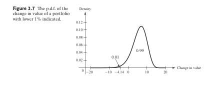

# MasteryCards

## Overview
MasteryCards is my final project for CS 181: Special Topics for CS. I am a huge user of flashcards to study for all of my college courses and I create hundreds of flashcards each semester. The stack of them on my desk, overflowing from my limited number of flashcard cases, was my inspiration for this final project. In this project I aim to create a system that can take a pdf textbook, specifically my probability textbook, *Probability and Statistics Fourth Edition* by DeGroot and Schervish, and construct all the flashcards I would need for the chapters I am covering. Below this I have outlined the features of my system, the neccessary setup for anyone to run it, an in-depth dive of the code I used, and finally a results section judging the final results on some fair criteria.

## Features

These are some of features it includes:
- It takes the input of a pdf textbook and chunks it at paragraph to abide by chunk token limits.
- Using a heavily detailed prompt that forces strucutured responses it can parse effectively, it turns the chunked text into flashcards of important topics and keywords (front) and explanations and examples (back).
- It accurately identifies the location of and takes snapshots of figures in this textbook without cutting the figure off or including other text.
- It creates flashcards for the figures from the textbook by scraping text around the figure, such as its caption, and prompts the LLM to create an accurate front side of the flashcard with the image on the back visualizing the topic.
- All of these flashcards are compiled and using the structure format of the responses to the prompts it is formatted into a tab-seperated values (TSV) file that is compatible with Anki.
- Next you are able to take the TSV flashcards that have been created and go over to the Anki application and import them as a new deck. From there you can start studying!

## Setup

**STEP 1: Install requirements** 

I highly suggest first activating a virtual enviroment but after that go ahead and install the all the requirements need for this project using:
```
pip install -r requirements.txt
```

**STEP 2: Generate Groq API Key** 

Next go to [Groq](https://console.groq.com/keys) and generate an API key.

The set the key in your terminal enviroment using:
```
export GROQ_API_KEY="your_api_key_here"
```

You can check this is done correctly by running:
```
echo $GROQ_API_KEY
```
If you recieve the key you inputted it is working.

**STEP 3: Upload the pdf you want to work with to your working directory as this file so it can be accessed in future steps.**

**STEP 4: Download the Anki 2 application.**

Go the [Anki 2 install page](https://apps.ankiweb.net/) and press the download button. Follow the instructions and open the application once it is on your computer.  

## Running it

**STEP 1: Run the command**

To start the program use the command:
```
$ python3 MasteryCards.py
```

You will be prompted with:
```
Enter the PDF file name you want to analyze (ex: my_probability_textbook.pdf):
```

**STEP 2: Input file path**

In response to this you can type in name of your file in your directory and press enter. This will then prompt something like this:
```
Enter the PDF file name (with extension): text1.pdf
Processing chunk 1 of 220...
Processing chunk 2 of 220...
Processing chunk 3 of 220...
```

Expecting this to take about 15s per page to complete (in my experience).

**STEP 3: Copying the Anki media files**

Unfortunately since my numerous attempts to automize this have failed, you have to manually move the png files you have collected from your pdf to Anki media folder for them to be displayed on your flashcards.    

To do this you have to copy the contents of the created folder **anki_media** in your working directory and paste it into the Anki media folder located at:  

- On MacOs: ~/Library/Application Support/Anki2/<YourProfileName>/collection.media  

- On Windows:\Users\<YourUsername>\AppData\Roaming\Anki2\<YourProfileName>\collection.media  

- On Linux: ~/.local/share/Anki2/<YourProfileName>/collection.media  

Note: If you have not explicity logged into the Anki 2 application then your username will be 'User 1' even if you have an account and are logged into their website.  

**STEP 4: Import the flashcards to Anki 2**

Next you open the Anki2 application and press **Import Files**, then navigate to and select the **flashcards.tsv** file in your finder. This will create a new pop up window, here make sure there are only two columns in the **File** section and then press **Import** in the top right corner. After this it will go to a new Overview and Details page and you can close the window, returning you to the Anki2 application.

Now you are ready to select the **Default** deck and start studying!

## Key features In-depth

**1. Prompt to collect accurate and general flashcards from the content in structured format**

After a lot of fine tuning I used a prompt that provided me with flashcards that were general enough to cover full probability topics (not just textbook specific examples) while also creating enough flashcards on the subject. It also insits upon a strict format for the responses to abide by so I can accurately parse the output, seen here:

```
### BEGIN ENTRY ###
Term: [Term]
Definition: [Definition]
### END ENTRY ###
```
And here is the full prompt:

```
KEYWORD_PROMPT = """You are tasked with extracting structured information from the provided text. For each keyword or concept, provide the following in a consistent format:

1. **Term**: The key term or concept.
2. **Definition**: A concise and clear definition of the term or concept. Include relevant details or examples only if they are general and can stand on their own.

Format the output exactly like this (including all symbols and delimiters):

### BEGIN ENTRY ###
Term: [Term]
Definition: [Definition]
### END ENTRY ###

Ensure the following:
- Only create flashcards for general concepts or topics that make sense independently, outside of the current text. Avoid highly specific examples, scenarios, or terms that require additional context to be understood.
- Ensure the front and back of the flashcard are meaningful and complete on their own.
- If a definition cannot be generated for a term, do not create a flashcard for it. Skip such terms entirely.
- Use precise, concise language.
- Exclude unrelated or random words, redundant terms, or repeated examples.
- Ensure the output is ready to be concatenated with outputs from other chunks without ambiguity.

Do not include placeholder phrases like "Not provided in the text" or "No definition found." If a good definition cannot be generated, simply skip that term.
"""
```

**2. Figure extraction and margin detection:**

I detected figures by creating an a large array of the pixels around matches to Bolded words 'figure' using the library fitz and then used a function to detect large white margins to know where to crop a box around just the figure at.

```
def detect_white_margin(image_path, tolerance=250, min_consecutive_white=15):
    image = Image.open(image_path)
    image_array = np.array(image)
    height, width, _ = image_array.shape
    consecutive_white_rows = 0
    for y in range(height):
        row = image_array[y, :, :]
        if np.all(row >= tolerance):
            consecutive_white_rows += 1
            if consecutive_white_rows >= min_consecutive_white:
                return y
        else:
            consecutive_white_rows = 0
    return height
```
In this function you can see I use a **tolerance** of 250 to detect any white, off-white, or close-to-white pixels as white and then set the **min_consecuive_white** value of 15 (found by trial and error) to be the number of these consecutive pixels to detect when there is an actual margin being detected.  

I use the Image function from PIL (Python Imaging Library) to take the snapshot and then run through the rows of the image from top to bottom to identify where the figure ends. This updated height value is then used to create an accurate png snapshot of the figure which is saved to the anki_media folder to later be passed to Anki 2.

Here are some examples of extracted figures:

   
         


**3. Prompt for caption summarization/generalization.**

This is the second prompt I used to create structured front sides of flashcards for the figure flashcards. After scrapping the words around the figure references, including the caption for the figure, I input this into the LLM and ask it to understand what the figure is most likely showing and create a question for flashcard front about what the general topic and specific scenario looks like.

```
CAPTION_PROMPT = """
You are tasked with analyzing a provided caption for a figure and creating the front of a flashcard. Your goal is to interpret what the figure generally represents based on the caption, focusing on the sentence immediately following "Figure X.X" (or similar). From this, generate a meaningful, concise question or description for the front of the flashcard.

The question or description should focus **only on the topic or concept** represented by the figure, without directly referring to "the figure," "the graph," "Figure X.X," or any visual elements that are not visible to the learner. The front of the flashcard should be guessable and make sense **on its own**, even without seeing the figure.

Use the following strict format and instructions:

### BEGIN FLASHCARD ###
Prompt: [Write a clear and concise question or description for the front of a flashcard. Focus on the general topic, key concept, or relationship illustrated by the figure. Avoid referring to the figure, graph, or any visual elements directly.]
### END FLASHCARD ###

Guidelines:
- Pay close attention to the sentence following "Figure X.X" as it explains the concept or topic being shown.
- Write a question or description about the broader **topic, key relationship, or principle** the figure represents.
- Do not mention or reference the figure, graph, or visual elements directly (e.g., avoid phrases like “the figure shows” or “the graph represents”).
- Ensure clarity and conciseness so the learner can understand and guess the back effectively without needing to see the figure.
- Avoid vague phrasing or overly contextual details that don’t contribute to understanding.

Provide the refined flashcard prompt in the exact format described above. Do not include explanations, footnotes, or justifications outside the specified format.
"""
```

Here is an example of a created figure flashcard:

Front:

```
What does a joint probability distribution density function look like?
```

Back:


## Results:

1. **Breadth** Of the 20 predecided topics to judge the breadth of the flashcards for the three chapters I selected these 16 were included in some terminology:

Conditional Probability, Bayes’ Theorem, Law of Total Probability, Independent Events, Multiplication Rule for Probabilities, Conditional Independence, Sample Spaces, Events and Outcomes, Disjoint Events, Uniform Probability Distribution, Random Variables, Expected Value, Joint Probability, Marginal Probability, Augmented Experiment, and Law of Large Numbers

While these four where not: Partitions of a Sample Space, Mutual Independence, Mutually Exclusive Events, and Probability Trees

2. **Quality** Unfortunately since the final set of flashcards for the entire curriculum of my probability class is 535 flashcards long I couldn't evaluate all of them. But for a smaller set of 72 flashcard from half of the subchapters in Chapter 2, I got the results that 68 of them were roughly correct while only 48 of them refered to a general topic that was understandable (compared to an example in the textbook) and weren't direct repeats of previous flashcards.

3. **Figure Accuracy** Over the 35 figures extracted from the textbook it extracted 34/35 correctly and only missed Figure 3.9 which unexpectly is labelled under the figure in the textbook.